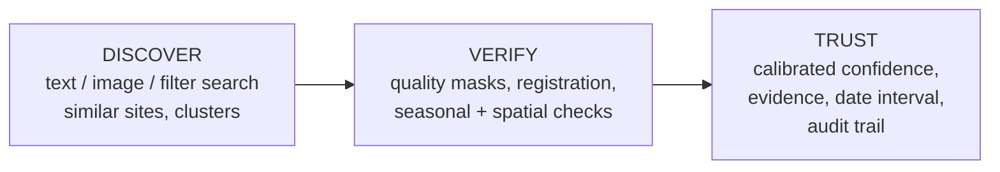
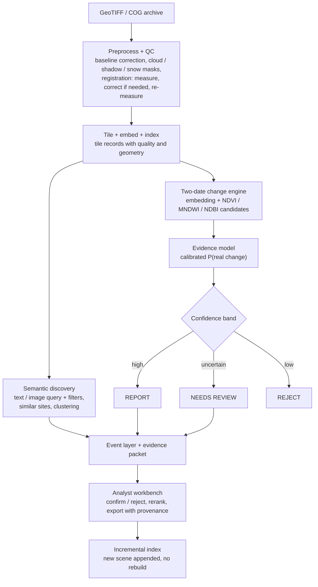
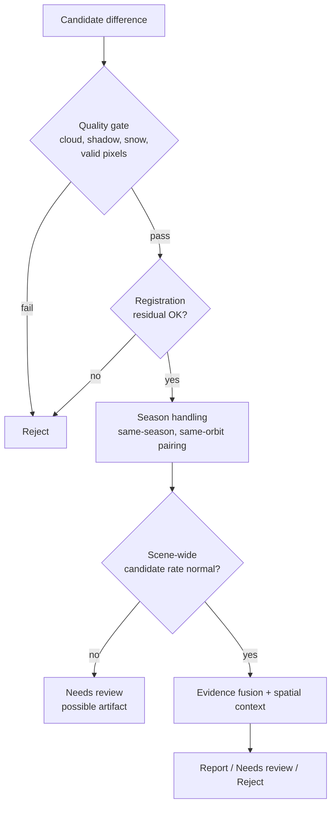
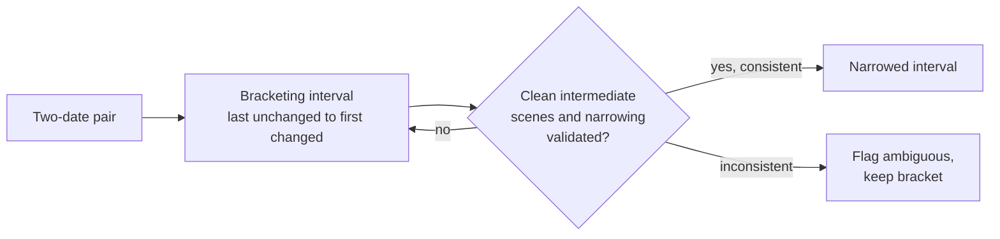

# SIH 2026 | PS SIH26227 | Slide-wise Points v2 (6 slides max)

Aligned to the "Selection-Focused, MVP-Scoped Technical Plan".
Core message on every slide: **Discover → Verify → Trust**

---

## Slide 1: TITLE PAGE
- Problem Statement ID: SIH26227
- Title: Semantic Retrieval and Multi-Temporal Change Analysis of Satellite Imagery
- Theme: (copy from portal)
- PS Category: Software
- Team ID / Team Name: Deadbeat Lions

---

## Slide 2: IDEA TITLE
**From searching imagery to finding trustworthy change**

**Proposed solution**
- Offline, on-premises system: semantic search front end + quality-aware change back end + analyst review tool
- Text query, image query, and spatial / date / sensor filters in one search
- Every reported change carries its evidence, confidence, provenance and an honest date interval
- Handles GeoTIFF / COG and keeps georeferencing end to end

**How it addresses the problem**
- Analyst no longer needs to know where and when to look first
- False change (season, cloud, snow, shadow, misregistration, sensor offsets) is filtered before it is reported
- Three outcomes, not forced yes/no: **Report / Needs review / Reject**
- Confirm/reject decisions are logged and can rerank the queue

**Innovation and uniqueness**
- **Honest dating**: last-unchanged and first-changed observation, never a fake exact date
- **Three separate scores**: P(real change), type evidence, date-pinning quality
- **Evidence packet per event**: index changes, embedding distance, registration residual, valid-pixel fraction, sun/orbit geometry, source scenes
- **Measured false-alarm controls**: every defence is a separate stage, so an ablation shows what actually helps
- **Scene-wide artifact check**: a suspiciously high candidate rate flags a systematic problem instead of a big "change"
- **Frozen precision-target protocol**: threshold chosen before held-out scoring, uncertainty by scene-level bootstrap

---

## Slide 3: TECHNICAL APPROACH

**Technologies**
| Layer | Choice |
|---|---|
| Core | Python, PyTorch, rasterio / GDAL |
| Data | Sentinel-2 L2A (MVP); Sentinel-1, Landsat, Bhuvan as extensions |
| Retrieval model | Benchmarked shortlist: GeoRSCLIP, SkyCLIP, RemoteCLIP (weights + licence packaged offline) |
| Vector index | FAISS (type chosen by benchmark); metadata kept in database |
| Metadata store | PostgreSQL + PostGIS or SQLite + SpatiaLite |
| Change evidence model | Logistic regression / shallow gradient boosting, calibrated |
| Registration / radiometry | Phase-correlation check (AROSICS-style), IR-MAD normalisation |
| Clustering | k-means / HDBSCAN on embeddings |
| App | FastAPI, Leaflet map UI |

**Methodology: end-to-end pipeline**

**Key implementation points**
- Change candidates = union of embedding distance and spectral signals, kept only if measurement shows it helps
- Split by scene / AOI, never by tile, to avoid leakage
- Config-driven, AOI-agnostic ingest so an unseen organiser AOI works with one command
- Runs with network disabled; verified by an offline restart test

---

## Slide 4: FEASIBILITY AND VIABILITY

**Feasibility**
- Public data only (Sentinel-2), open-source stack, no cloud or external API
- MVP is deliberately narrow: single sensor, two-date change, small evidence model instead of a deep network
- Tiered scope: Tier 0 (must work), Tier 1 (demonstrator), Tier 2 (gated experiments)
- A feasibility spike gates all later work: no Tier 1 / 2 build until Tier 0 is shown feasible

**False-alarm control flow (the core of viability)**

**Risks and mitigations**
| Risk | Mitigation |
|---|---|
| Seasonal change flagged as real | Same-season pairing, seasonal pairs as negatives, soft cropland handling |
| Cloud, haze, snow, shadow | Combined SCL + cloud-probability masks, snow-state pairing |
| Registration error | Measure first, correct only if needed, re-measure |
| Sentinel-2 processing-baseline offset | Convert to common convention on ingest, unit test on stable area |
| Too few clean scenes (monsoon) | Two-date MVP needs only a pair; report `insufficient_data` |
| 10 m resolution limits queries | Scope queries to visible patterns; benchmark before locking demo query |
| Small labelled set, wide uncertainty | Patch-level labels, scene-clustered bootstrap, status `provisional` when weak |
| Scope creep | MVP freeze gate and explicit cut order |

**Evaluation plan**
- Retrieval: baselines R0 to R2, Recall@K, mAP, seen vs unseen phrasing
- Change: precision, recall, F1 at pixel / tile / pair level, ablation ladder A0 to A7
- False alarms reported per category (seasonal, cloud, snow, shadow, registration, baseline, water, agriculture)
- System: area, scenes / tiles, build time, storage, latency (avg and p95), hardware

---

## Slide 5: IMPACT AND BENEFITS

**Impact on analysts**
- Ranked shortlist of places to review, not whole scenes
- Finds unknown sites via similar-site search and clusters
- Every result shows why it was flagged, so it can be trusted or challenged
- Decisions and exports carry full source-scene and processing provenance

**Honest temporal intelligence**

**Benefits**
- **Operational**: less manual scanning, fewer false leads, faster review
- **Sovereignty**: fully on-premises, no imagery or queries leave the environment
- **Economic**: open data and open-licence models, no per-query cloud cost
- **Civil use**: same system supports flood extent, land clearance, urban growth
- **Environmental**: tracks water-extent and vegetation change over time
- **Scalable**: incremental ingestion; SAR and other sensors can be added later

---

## Slide 6: RESEARCH AND REFERENCES

**Data**
- Copernicus Sentinel-2 L2A (and Sentinel-1): Copernicus Data Space Ecosystem
- USGS Landsat Collection 2
- NRSC / ISRO Bhuvan open EO products
- ESA WorldCover (optional land cover)

**Models, benchmarks and methods**
- CLIP (Radford et al., 2021)
- RemoteCLIP, GeoRSCLIP, SkyCLIP: remote-sensing vision-language models
- OSCD Sentinel-2 change-detection dataset (licence of labels to be confirmed)
- IR-MAD radiometric normalisation; AROSICS-style co-registration
- ESA Sentinel-2 processing-baseline documentation

**Tools and standards**
- FAISS, HDBSCAN, PostGIS, GDAL / rasterio
- Cloud Optimized GeoTIFF (COG) specification

> Confirm exact titles, years and licences before submission.

---

## Notes for the team (not for the slides)
- SIH allows 6 slides and no paragraphs. This file already compresses your plan; cut table rows first if a slide overflows.
- Your Appendix A lists 30 September 2026 as a tracker-reported deadline. Today is 29 September, so confirm on the official portal now.
- Wording to keep consistent: "designed for on-premises / offline operation", "earliest supported observation", "False-alarm controls" (use "Firewall" only if the ablation supports it).
